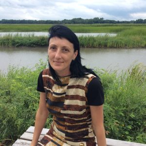
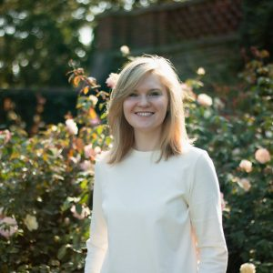
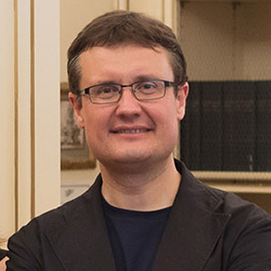

<param ve-config 
       title="Plant Humanities Lab"
       layout="index">

# Essay Contributors

##
**Yota Batsaki**

Yota Batsaki is the executive director of Dumbarton Oaks, a Harvard research institute, museum, and historic garden located in Washington, D.C. She holds a Ph.D. in comparative literature from Harvard University and was previously a lecturer and fellow at St. John’s College, Cambridge. Batsaki contributes to the research agenda of Dumbarton Oaks as principal investigator of the Plant Humanities Initiative. Funded by the Andrew W. Mellon Foundation, this is a four-year initiative to advance the emerging field of plant humanities in close dialogue with the environmental humanities and with a focus on plant-human interactions. Batsaki leads a collaboration with JSTOR Labs to develop an open access digital platform that will highlight primary sources about plants and connect them to large databases such as Global Plants and the Biodiversity Heritage Library. She also oversees scholarly programming that brings together intergenerational teams of students and researchers to investigate and narrate important cultural histories of plants for the digital platform under development.

##
**Ashley Buchanan**

Ashley Buchanan is the Postdoctoral Fellow for the Plant Humanities Initiative at Dumbarton Oaks. She is a historian of the early modern world, with a particular interest in plants, recipes, and medicinal cultures in 17th- and 18th-century Europe. She received her PhD in early modern history from the University of South Florida in 2018. Her research spans many topics which includes the history of science and medicine, women, and politics as well as the dynamics of gender and authority. Her current book project investigates the social, cultural, and political significance of pharmaceutical experimentation as well as the medicinal and botanical patronage at the late Medici Court (1650-1743). Her goal is to broaden the global dimension of recipes by studying the numerous exotic plants imported into Tuscany from the New World, East Africa, and Southeast Asia in the late 18th century. Ashley was a junior fellow in residence with the Medici Archive Project at the Archivio di Stato di Firenze and an Andrew W. Mellon Foundation Fellow at The Huntington.

##
**Julia Fine**

Julia Fine is a graduate student at the University of Cambridge studying Modern South Asian Studies as a George Kingsley Roth and Cambridge Trust Scholar. She received her A.B. from Harvard University in History & Literature. In 2019, Julia was a fellow at the Folger Shakespeare Library, where she worked on the Mellon-funded “Before ‘Farm to Table’: Early Modern Foodways and Cultures“ project. In 2020, she joined the Plant Humanities Initiative at Dumbarton Oaks, where she explored the movement of plants through the lens of imperial ambitions specifically within the context of the Indian Ocean world.

##
**Rebecca Friedel**

Rebecca Friedel focuses on the cultural histories of plants from the Americas as a Plant Humanities Research Associate with Dumbarton Oaks. Friedel is also a paleoethnobotanist and PhD candidate in Anthropology at the University of Texas at San Antonio. Her doctoral research takes an interdisciplinary approach to reconstructing ancient Maya human-plant relationships. She is currently a U.S. Fulbright Scholar at the University of Belize where she is teaching under and establishing a BA program in Anthropology. She is passionate about education and improving access to knowledge more broadly, having co-founded an educational outreach 501c3 organization, Heritage Education Network Belize.

##
**Kristan M. Hanson**

Kristan M. Hanson is a Plant Humanities Fellow at Dumbarton Oaks. She is an art historian of nineteenth-century France, with a particular focus on depictions of women, ornamental plants, and spaces of horticultural labor and leisure. She received her PhD in art history from the University of Kansas in 2020. Her research interests include visual portrayals of plants and human-plant interactions; cultural associations of flowers and floral imagery with social markers of difference; horticultural trade networks, colonialism, and intimacy; and artistic engagements with environmental issues. Her dissertation applied digital humanities methods and tools to the study of horticultural art, plant mobility, and gendered spatial practices in the context of 1870s Paris. She has received fellowships and awards from the Oak Spring Garden Foundation, HASTAC Scholars program, and the Hall Center for the Humanities. Most recently, she coedited the exhibition catalogue Perspectives on a Legacy Collection: Sallie Casey Thayer’s Gift to the University of Kansas (2020).

##
**Wouter Klein**

Wouter Klein is Plant Humanities fellow at Dumbarton Oaks. A historian from the Netherlands, he received his PhD from Utrecht University in 2018. He is interested in the interconnected history of medicine, pharmacy, and botany in the early modern period; the circulation of knowledge and commodification processes of therapeutic drugs; and digital research methods to study medical practices of the past over the long term. He has a particular interest in the availability of materia medica in the past, either as commercial goods in trade records, research specimens for academic physicians, or commodified products for the general public. His research aims to unravel the question of how the global dimensions of commerce, science, and society helped some non-European natural substances become major commercial ingredients for medicines while others had much less success in the early modern medical marketplace. To tell those stories, his research makes use of large collections of digital historical data, like private correspondence, pharmaceutical manuals, auction records, and newspaper advertisements.

##
**W. John Kress**

W. John Kress is Distinguished Scientist and Curator Emeritus at the Smithsonian’s National Museum of Natural History and co-chair of the Earth BioGenome Project. He was curator of botany for over thirty years and formerly served as the interim undersecretary for science at the Smithsonian and director of science in the Grand Challenges Consortia. Kress received his B.A. from Harvard University and Ph.D. from Duke University, where he studied tropical biology, ethnobotany, evolution, and ecology. He is a taxonomic specialist on the tropical Zingiberales, and his current research is focused on biodiversity genomics, conservation, and the Anthropocene. Among his more than 200 scientific and popular publications are his books Plant Conservation: A Natural History Approach, The Weeping Goldsmith, The Art of Plant Evolution, and The Ornaments of Life: Coevolution and Conservation in the Tropics. His most recent book isLiving in the Anthropocene: Earth in the Age of Humans. He is a fellow of the American Association for the Advancement of Science and is currently visiting scholar at Dartmouth College and the Arnold Arboretum of Harvard University. He lives in Dorset, Vermont.

##
**Victoria Pickering**

Dr. Victoria Pickering is a Research Associate in the Plant Humanities Initiative, having been a Research Fellow at Dumbarton Oaks  between 2019-2020. Previously, she researched the global movement of plants from the late seventeenth century onward at the British Museum and the Natural History Museum in London. Today, she continues to explore the collection, description, management, and use of natural history objects in the early modern period.

##
**Anatole Tchikine**

Anatole Tchikine is curator of rare books at Dumbarton Oaks. An architectural historian and a specialist on early modern Italy, he holds a PhD from the University of Dublin, Trinity College. His work mainly addresses the intersections of art and science, including the history of fountain design, botanical gardens, and collecting and representations of nature. He is the author, with Pierre de la Ruffinière du Prey, of _“Discrizione della Villa Pliniana”: Reimagining Antiquity in the Landscape of Umbria_ (2021), editor of _The Three Natures: Gardens and Landscapes of the Italian Renaissance_ (forthcoming), and coeditor of _The Botany of Empire in the Long Eighteenth Century_ (2016) and Military Landscapes (2021).
